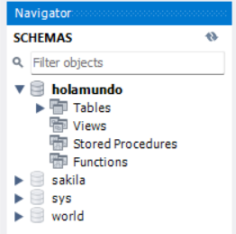

# Introduction

## Workbench shortcuts

Execute queries:

> ctrl + enter

## Difference between MySQL and SQL

- MySQL: Database management system.

- SQL ('sequel'): Structured Query Languages. Not a programming language, but a data extraction language.


# First Steps

## Setup New Connection in Workbench

1. Click on '+'


2. Write a connection name

3. Click on 'Test connection'
   > A window with 'Please enter password' should appear

4. Enter password and click on 'Ok
   > Connection should have been added to the start page

**Note.**

> Troubles can appear here if XAMPP is installed, because it also uses 3306 port.

## Select DB

Assuming we have a DB named 'holamundo',

1. Write and execute:

```sql
use holamundo;
```

> Note: This is needed everytime MySQL Workbench is opened. Otherwise, error 'No database selected' will be showed in screen.
>

## Activate 'Schemas' view

To the far left of the screen, there's a 'navigator' tab with two options: 'Administration' and 'Schemas.' For the greater part of this course, 'Schemas' is the most useful, as it allows to see and modify created tables.




# DB fundamentals: Create-Read-Update-Delete (CRUD)

## Data types

- int
- float
- varchar

## Create a DB

1. Write:

```sql
create database holamundo;
```

2. Click on the **'lightning' symbol to execute**
	> In the bottom there's the 'terminal', known as 'Action output'. There we'll see a record of the actions performed.

## Find out existing databases managed by MySQL

1. Write and execute:

   ```sql
   show databases;
   ```

## Create a table

1. Write and execute:

   (1/2)

   ```sql
   use holamundo;
   ```

   (2/2)	

```sql
CREATE TABLE animales(
    /* Rows */
	id			int,
 -- id			int NOT NULL AUTO_INCREMENT		 -- (Optional) Give 'id' an auto-increase property  
	tipo		varchar(255),					-- varchar's argument indicates max size of string
    estado		varchar(255),
    PRIMARY KEY(id)								-- indicate which row is the PK
);
```

## Modify an existing table

**Give 'id' an auto-increase property**

1. Write and execute:

```sql
ALTER TABLE animales MODIFY COLUMN id int auto_increment;		-- table, column, var type
```

## Insert data inside a table

1. Write and execute:

```sql
INSERT INTO animales (tipo, estado) VALUES('caballo', 'feliz');		-- Fields, Values
```

## Get the  'creation query' of a table

This may be useful to see how our fields are defined, or maybe to create a replica table. 

1. Write and execute:
2. 
(1/2)

```sql
use holamundo;
```
(2/2)

```sql
SHOW CREATE TABLE animales;
```

Note:

> For this statement to work, it needs to be executed as a standalone query. That is, if our 'script' window has any other code lines, it won't work. We need to comment or delete all other statements.

2. In 'result grid': 
   1. Right click on 'Create table'
   
   2. Click on 'Copy field (unquoted)'
   

After this, we are able to paste the Query and see how that table is defined. It should look like this: [Table creation query](#Create-a-table)

Note:

> This can also be achieved via the 'Schemas' tab at the far left: right clicking on the table name, then 'Copy to clipboard' and finally 'Create Statement'. For more info, see: [Schemas](#Activate-'Schemas'-view)

## List elements in a table (Select)

- View an entire table:

```sql
SELECT * FROM animales;						-- Select all from table 'animales'
```

- Select a specific element based on a column value:

  Example 1:

```sql
SELECT * FROM animales WHERE id = 1;		-- Select all from 'animales' where id is 1
```
​	Example 2:

```sql
SELECT * FROM animales WHERE estado = 'feliz';		-- Note that the value goes between quotes
```

- Select a specific element based on many column values:

```sql
SELECT * FROM animales WHERE estado = 'feliz' AND tipo = 'perro';		-- Note the use of 'AND' operator
```

## Update existing entries

- Change a specific element based on its **primary key**:

  For example, assuming that the data in animales/id=3/estado is 'triste' and we want it to be 'feliz', 

```sql
UPDATE animales SET estado = 'feliz' where id = 3;		-- In record /animales/id=3 change estado to 'feliz'
```

Note:
> If we try to use the query presented above with a non-key column, we'll get an error, because MySQL comes with a 'safe mode' that prevents from deleting a record. This, of course, can be disabled in Preferences->SQL editor and reconnect, but it is recommended not to.

## Delete records

- Delete a record based on its **primary key**:

```sql
DELETE FROM animales where id = 3;
```

Note:
> This query is also affected by 'safe mode'. See  [Update existing entries](#Update-existing-entries)

# Conditions in deep

> Note: This table and the following entries were created as an example for the contents that will be described later.
>
> CREATE TABLE usuario (
> 	id int not null auto_increment,
> 	nombre varchar(50) not null,
> 	edad int not null,
> 	email varchar(100) not null,
> 	primary key (id)
> );
>
> INSERT INTO usuario (nombre, edad, email) values ('Oscar', 25, 'oscar@gmail.com');
> INSERT INTO usuario (nombre, edad, email) values ('Layla', 15, 'layla@gmail.com');
> INSERT INTO usuario (nombre, edad, email) values ('Nicolas', 36, 'nico@gmail.com');
> INSERT INTO usuario (nombre, edad, email) values ('Chanchito', 7, 'chanchito@gmail.com');

## Select

- **Limit the** number of records that will return as **output** in a selection.

```sql
select * from usuario limit 2;			-- In table 'user', select only the records 1 and 2
```

- **Comparative** operators (>= and <=) for selections.

```sql
select * from usuario where edad > 15;
```

- **OR** operator for selections.

```sql
select * from usuario where edad > 20 or email = 'layla@gmail.com';
```

- **Inequality** (!=) operator for selections.

```sql
select * from usuario where email != 'layla@gmail.com';
```

- **Between** and **and** operators for selections.

```sql
select * from usuario where edad between 15 and 30;
```

- **Like** operator for **specific word search** in a selection. 
  - Option A: the text we're looking for can be in the middle of a larger word.
  ```sql
  select * from usuario where email like '%gmail%';			-- Note the use of '%  %'
  ```
  - Option B: the text we're looking for must be the start of a word.
  ```sql
  select * from usuario where email like 'oscar%';			-- Note the use of '  %'
  ```
  - Option C: the text we're looking for must be the end of a word.
  ```sql
  select * from usuario where email like '%.com';				-- Note the use of '%  '
  ```

- **Sort** the selection.

  - Ascending order
  ```sql
  select * from usuario order by edad asc;						-- asc
  ```
  - Descending order
  ```sql
  select * from usuario order by edad desc;						-- desc
  ```
  
- **Max value** search.

```sql
select max(edad) as mayor from usuario;
```

- **Min value** search.

```sql
select min(edad) as menor from usuario;
```

- Show **specific columns**.

```sql
select id, nombre from usuario;					-- Shows 'id' and 'nombre' columns
```

* Show **specific columns** with an **alias**.

```sql
select id, nombre as apodo from usuario;		-- Instead of 'nombre' we'll see 'apodo'
```

- Assign an **alias identifier** to a table **for selection query**.

```sql
select u.id, u.email from usuario u;
-- Sets 'u' as identifier for 'usuario' table in this query.
-- Searchs and shows 'id' and 'email' columns from 'usuario'.
```

## Create a table with a foreign key

1. Write and execute:

```sql
CREATE TABLE productos (
	id int not null auto_increment,
	nombre varchar(50) not null,
	creado_por int not null,					-- Var that will serve as foreign key
	marca varchar(50) not null,
	primary key (id),
	foreign key(creado_por) references usuario(id)	-- Here, FK var is linked to the 1st table PK
);
```

> Note: This second table was also created as an example for the contents that will be described later

## Change a table's name

1. Write and execute:

```sql
rename table productos to producto;
```

> Remember to click on the 'refresh' button to see the changes in tbe 'Schemes' tab

## Insert multiple values to existing columns

1. Write and execute:

```sql
insert into producto (nombre, creado_por, marca)
values
	('ipad', 1, 'apple'),			-- 1st row to be inserted
	('iphone', 1, 'apple'),			-- 2nd row to be inserted
	('watch', 2, 'apple'),
	('macbook', 1, 'apple'),
	('imac', 3, 'apple'),
	('ipadmini', 2, 'apple');
```

## Left join (Select)

**"Bring all selected entries from left table (according to query condition) and bring right table's entries if and only if they are associated to a entry in left table."**  

Venn diagram:

- All red entries (left) are brought to the selection.
- Only partial blue entries (right) are brought to the selection.
- No coincidences bring a NULL in blue selections (right).

<svg width="200" height="150" xmlns="http://www.w3.org/2000/svg">
    <!-- Circle 1 with white outline -->
    <circle cx="100" cy="75" r="40" fill="#0D1117" stroke="white" stroke-width="1" opacity="1" />
    <!-- Circle 2 -->
    <circle cx="50" cy="75" r="40" fill="red" stroke="#A20000" stroke-width="1" opacity="0.8" />
</svg>

Assuming:

1. We have two tables: 'usuario' (1st) and 'producto' (2nd) with their corresponding columns.

2. We've linked a column of the 2nd table (creado_por) to a column of the 1st (id) to be a FK, [like this](#Create-a-table-with-a-foreign-key).

Then, what we have is the following:

- 'id' columns in both tables contain incremental values.

- 'id' and creado_por' are identifiers that refer to the same data (e.g. user 1, user 2, ...) but in different tables (usuario, producto).

- Making a selection of 'usuario' will show the columns: id - nombre - edad - email,

  while a selection of 'producto' will show the columns: id - nombre - creado_por - marca

Left join will allow us to make a selection of columns from the 2 tables. 

```sql
select u.edad, u.email, p.nombre	-- Order in which the columns will be shown
from usuario u			-- Left table: all existing records in its selected columns will be shown
left join producto p	-- Right table: only records that satisfy the condition will be shown
on u.id = p.creado_por;	-- Condition: sort rows in selected 'p' columns to match rows in selected 'u' columns.

/* 'p' rows of 'p.nombre' whose 'creado_por' value is 3 will be placed next to 'u' rows whose 'id' is also 3 
   'p' rows of 'p.nombre' whose 'creado_por' value is 9 will be placed next to 'u' rows whose 'id' is also 9
   ...
*/
```

So, at the end, we would see something like this:

<table style="width: 70%; text-align: center; vertical-align: middle; border-collapse: collapse;">
  <thead>
    <tr>
      <th width="33%">edad (left)</th>
      <th width="33%">email (left)</th>
       <th width="33%">nombre (right)</th>
    </tr>
  </thead>
  <tbody>
    <tr>
      <td> 25</td>
      <td> oscar@gmail.com</td>
      <td> macbook</td>
    </tr>
    <tr>
      <td> 25</td>
      <td> oscar@gmail.com</td>
      <td> iphone</td>
    </tr>
    <tr>
      <td> 15</td>
      <td> layla@gmail.com</td>
      <td> ipadmini</td>
    </tr>
    <tr>
      <td> 15</td>
      <td> layla@gmail.com</td>
      <td> watch</td>
    </tr>
    <tr>
      <td> 36</td>
      <td> nico@gmail.com</td>
      <td> imac</td>
    </tr>
    <tr>
      <td> 7</td>
      <td> chanchito@gmail.com</td>
      <td><strong>null</strong></td>
    </tr>
  </tbody>
</table>

Notice two things:

1. **'u' entries are shown as many times as there are coincidences with 'p' entries.**
2. **If there is no coincidence for a specific 'u' entry, there will be a NULL value in 'p' columns.**

## Right join (Select)

**"Bring all selected entries from right table (according to query condition) and bring left table's entries if and only if they are associated to a entry in right table."**  

Venn diagram:

- Only partial blue entries (left) are brought to the selection.
- All red entries (right) are brought to the selection.
- No coincidences bring a NULL in blue selections (left).

<svg width="200" height="150" xmlns="http://www.w3.org/2000/svg">
    <!-- Circle 1 with white outline -->
    <circle cx="50" cy="75" r="40" fill="#0D1117" stroke="white" stroke-width="1" opacity="1" />
    <!-- Circle 2 -->
    <circle cx="100" cy="75" r="40" fill="red" stroke="#A20000" stroke-width="1" opacity="0.8" />
</svg>

Using the sample tables created above:

```sql
select u.edad, u.email, p.nombre
from usuario u
right join producto p
on u.id = p.creado_por;
```

s
